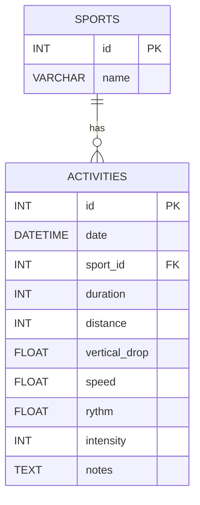

```mermaid
erDiagram
    SPORTS {
        INT id PK
        VARCHAR name
    }
    
    ACTIVITIES {
        INT id PK
        DATETIME date
        INT sport_id FK
        INT duration
        INT distance
        FLOAT vertical_drop
        FLOAT speed
        FLOAT rythm
        INT intensity
        TEXT notes
    }

    SPORTS ||--o{ ACTIVITIES : "has"
```
